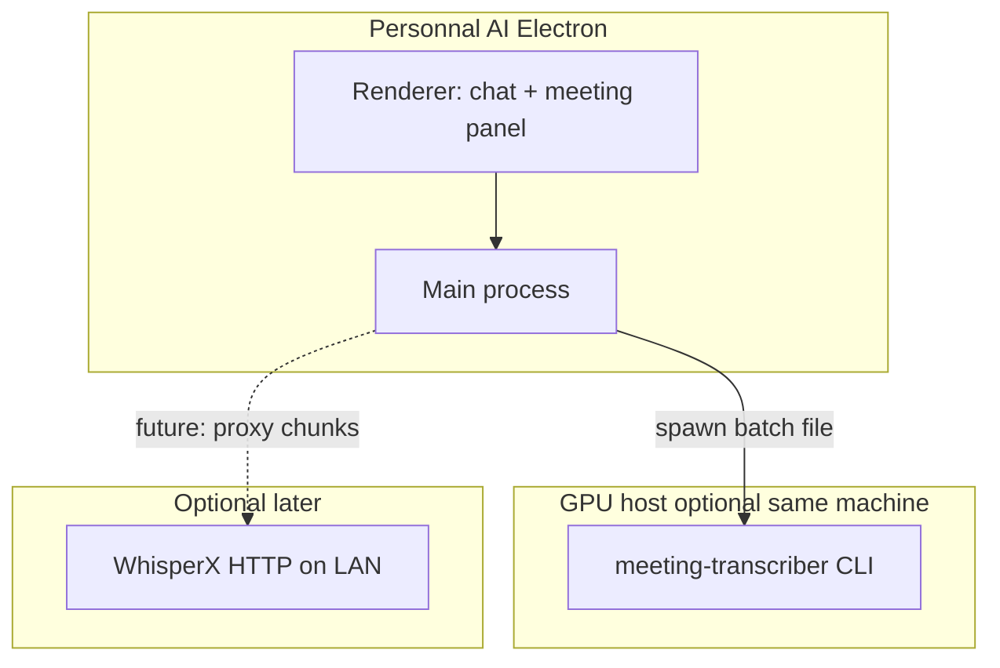

# Unify meeting transcription in Personnal AI

## Status
ready-for-github

## Change type
feature

## Summary

Retire `live-transcribe/`, then wire **meeting transcription** into the Personnal AI Electron app while keeping **`meeting-transcriber/`** as the local GPU CLI backend.

## Motivation

Mathieu asked to merge Personnal AI and meeting transcriber. `live-transcribe` is the same idea in a duplicate shell and should be removed—not maintained alongside the desktop app.

Decision: [docs/decisions/2026-10-01-unify-transcription-in-desktop-app.md](../decisions/2026-10-01-unify-transcription-in-desktop-app.md).

## Target architecture

- **Batch (MVP):** User picks an audio file in the app → main process runs `python3 -m src.cli …` in `meeting-transcriber/` (configurable venv path) → progress + transcript JSON/txt shown in UI (new thread or dedicated panel).
- **Secrets:** `HF_TOKEN` stays in `meeting-transcriber/.env` or app-level env; never in `/docs`.
- **LAN live capture:** Out of scope for the first merge slice unless explicitly added as a follow-up issue inside the same app (no revived `live-transcribe` package).

## Acceptance criteria

### Scenario 1 — Remove live-transcribe

- **Given** the repository after merge
- **When** a developer searches for `live-transcribe`
- **Then** there is no `live-transcribe/` directory, no `npm run live-transcribe` script, and [features/live-transcribe-web.md](../features/live-transcribe-web.md) marks the feature **retired**
- **And** root `README.md` no longer advertises the standalone web app

### Scenario 2 — Desktop entry for batch transcription

- **Given** Personnal AI running (`npm run dev` or `npm run ui` with equivalent IPC/API)
- **When** the user selects a local audio file and starts transcription
- **Then** the app invokes the meeting-transcriber CLI (or surfaces a clear error if Python/venv/CUDA/HF_TOKEN is missing)
- **And** speaker-attributed text (or JSON turns) appears in the UI without opening a separate web server on `:5174`

### Scenario 3 — CLI unchanged as library boundary

- **Given** `meeting-transcriber/`
- **When** `PYTHONPATH=. python3 -m unittest discover -s tests` runs
- **Then** postprocessor tests still pass (GPU pipeline unchanged except optional small hooks for programmatic invoke)

### Scenario 4 — Docs trace

- **Given** this batch ships
- **Then** [features/meeting-transcriber.md](../features/meeting-transcriber.md) describes Electron integration
- **And** PR #2 is reconciled (drop live-transcribe commits or superseding PR)

## Proposed GitHub issues (one batch, one PR)

| # | Title (draft) | Scope |
| --- | --- | --- |
| A | `[cleanup] Remove live-transcribe package and references` | Delete subtree, gitignore, docs, close/supersede #3 |
| B | `[app] Meeting transcription panel in Electron` | File picker, IPC, spawn CLI, show output |
| C | `[docs] README and runbook for unified app` | Single “Run” story: chat + meeting transcriber setup |

## Out of scope

- Rebuilding phone LAN UI as a separate Vite app
- Ollama summarization of transcripts (existing open question)
- Replacing WhisperX with a different STT stack

## Notes

- Open PR [#2](https://github.com/MathieuLaureti/personnal_ai/pull/2) currently bundles meeting-transcriber CLI + live-transcribe; this batch should **drop live-transcribe from that line of work** and add integration instead.
- Dependency/npm alignment (Node 20+, Vite stack) can be a separate small issue if still blocking local dev.
